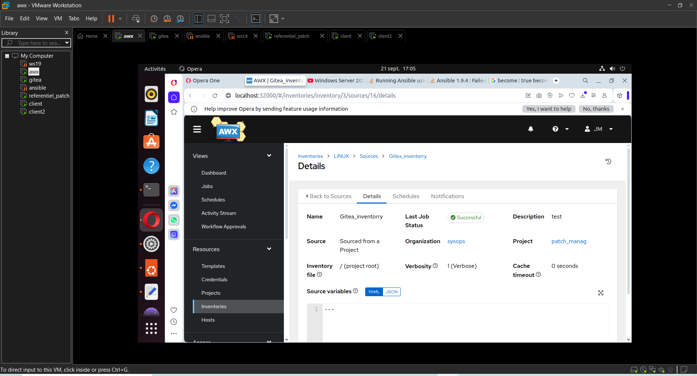
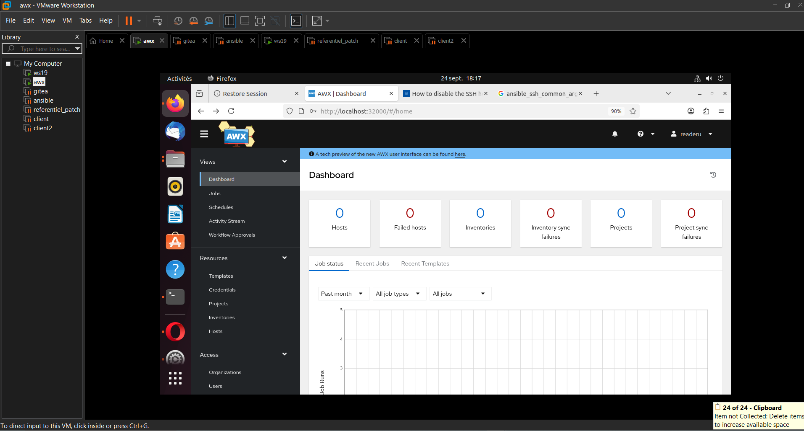

# 🚀 PROJET : CONFIGURATION ET DEPLOIEMENT AWX 

---

## SOMMAIRE

- [🚀 PROJET : CONFIGURATION ET DEPLOIEMENT AWX](#-projet--configuration-et-deploiement-awx)
  - [SOMMAIRE](#sommaire)
  - [📝 INTRODUCTION](#-introduction)
  - [🛠️ OUTILS UTILISES](#️-outils-utilises)
  - [🔧 PREREQUIS](#-prerequis)
  - [🐙 DIFFERENTS LIENS POUR L'INSTALLATION AWX\_ET\_DU\_DRIVER\_DOCKER](#-differents-liens-pour-linstallation-awx_et_du_driver_docker)
  - [🏠 INTERFACE D'ACCEUIL AWX](#-interface-dacceuil-awx)
  - [🧰 QUELQUES COMMANDES](#-quelques-commandes)
---

## 📝 INTRODUCTION

Dans le monde actuel, avoir une vision globale et détaillée d'un système informatique constitue un élément de base pour le bon fonctionnement de ce dernier.
il est important de signifier qu'une simple vision globale ne suffit pas, car il faut savoir comment organiser, planifier, exécuter, vérifier les différents logs, les différentes mises à jour,  les différentes machines du réseau, etc...
Afin d'être productif et de reagir rapidement en cas d'un dysfonctionnement qui pourrait subvenir.

Dans le cadre du projet, nous avons utilisé __AWX-OPERATOR__, qui est un outil open source et permet d'exécuter les différentes tâches.

---

## 🛠️ OUTILS UTILISES

- OS: LINUX.
- KUBERNETES.
- VS_CODE.
- SSH.
- HYPERVISEUR type 2 : vmware_workstation.
- PROTOCOLE RSYNC.
- DOCKER.

---


## 🔧 PREREQUIS

- OS : Ubuntu 22.04 LTS
- Disque : SSD 40GO
- RAM : 12GO
- HYPERVISEUR DE TYPE 1 ou 2

---


## 🐙 DIFFERENTS LIENS POUR L'INSTALLATION AWX_ET_DU_DRIVER_DOCKER

__Installation d'un CLUSTER MINIKUBE pour KUBERNETES__

- [installation cluster minikube](https://kubernetes.io/fr/docs/tasks/tools/install-minikube)

__Installation de docker__

- [installation docker engine](https://docs.docker.com/engine/install/ubuntu)
- [installation docker compose](https://docs.docker.com/compose/install/linux/#install-using-the-repository)


__Pour installer AWX :__

- [Installation cluster AWX](https://github.com/ansible/awx-operator/blob/devel/docs/installation/creating-a-minikube-cluster-for-testing.md)
- [installation AWX-OPERATOR](https://github.com/ansible/awx-operator/blob/devel/docs/installation/basic-install.md)
- [installation du kustomize](https://kubectl.docs.kubernetes.io/installation/kustomize/)
- [version de la release](https://github.com/ansible/awx-operator/releases)
- [installation du kind](https://github.com/ansible/awx-operator/blob/devel/docs/installation/kind-install.md)

---

## 🏠 INTERFACE D'ACCEUIL AWX

Dans le cadre de l'interface d'acceuil d'awx il y en a deux: 

* Action d'un administrateur général sur AWX

  

* Interface d'acceuil avec connexion du l'utilisateur LDAP

  

---

## 🧰 QUELQUES COMMANDES

Voici quelques commandes à exécuter sur AWX déployé avec Kubernetes
 
- Vérification des pods : 
  
```shell 
$ kubectl get pods
```
  
- Vérification des nodes : 

```shell 
$ kubectl get nodes
```

- Accéder à un pod : 
 
```shell 
$ kubectl exec -it nom_du_pod -- /bin/bash
```
  
- Tester la connectivité d'un utilisateur ldap : 
 
```shell 
$ ldapsearch -x -H ldap://192.168.9.130:389 -D "readerU@marco.lan" -W -b "DC=marco,DC=lan" sAMAccountName
``` 
  
---

__*NB: Il est important de savoir que dans la veille technologique, il arrive que certaines configurations changent, raison pour laquelle il est important de se référer régulièrement à la documentation officielle afin de voir les différentes mises à jour*__.
