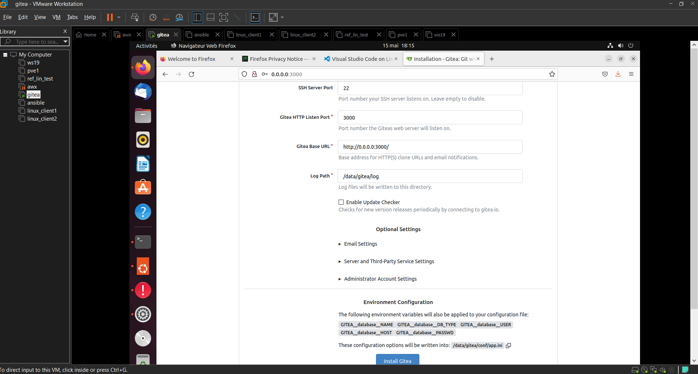

# PROJET: DEPLOIMENT DE GITEA AVEC DOCKER

---

## SOMMAIRE

1. [INTRODUCTION](#introduction)
2. [ LIEN GITHUB SUR LE FICHIER DE CONFIGURATION  GITEA AVEC DOCKER](#lien-github-sur-le-fichier-de-configuration--gitea-avec-docker)
3. [INSTALLATION DE GITEA](#introduction)
4. [PREREQUIS](#prerequis)
5. [OUTILS UTILISES](#outils-utilises)
6. [INSTALLATION DE GITEA](#installation-de-gitea)
7. [EXECUTION DU FICHIER ](#execution-du-fichier)
8. [INSTALLATION DOCKER ENGINE ET DOCKER COMPOSE](#installation-docker-engine-et-docker-compose)
9. [GENERATION DU CERTIFICAT AUTO-SIGNE AVEC OPENSSL](#generation-du-certificat-auto-signe-avec-openssl)
10. [DOCUMENTATION OFFICIELLE NGINX](#documentation-officielle-nginx)
11. [QUELQUES COMMANDES](#configuration)

---

## INTRODUCTION

De nos jours, la gestion de différentes ressources telles que (RAM,CPU,DISQUE) constitue un lévier puissant permettant de déployer divers types d'application, logiciel, etc... Afin de maximiser ces différentes ressources il serait mieux de le faire de manière plus isolée pour ne point pertuber le fonctionnement de la machine hôte. Et cela qu'intervient l'importance de la conteneurisation avec Docker. Dans le cadre de notre projet, nous allons déployé un serveur gitea avec docker. 

## LIEN GITHUB SUR LE FICHIER DE CONFIGURATION  GITEA AVEC DOCKER

[Lien GitHub du fichier de configuration](https://github.com/jeanmarctsh/gitea_deploy/tree/gitea)

__Branche principale : gitea__

---

## PREREQUIS

- OS : Ubuntu 22.04 LTS
- Disque : SSD 25GO
- RAM : 4GO
- HYPERVISEUR DE TYPE 1 ou 2

---

## OUTILS UTILISES 

- SSH 
- De vscode pour éditer les différentes configurations
- D'un serveur web nginx afin de l'utiliser comme reverse-proxy
- D'un OS (Linux) (afin d'exécuter les différentes commandes administratives et de la  gestion de permission)
- De OpenSSL afin de générer nos certificats auto-signés
- De AWX pour synchroniser Gitea 

---

## INSTALLATION DE GITEA

Pour installer Gitea il faut procéder de la manière suivante:

- sudo mkdir /home/username nom_du_dossier (exemple: sudo mkdir /home/gitea/gitea_folder)
- sudo cd gitea_folder && nano docker-compose.yml (dans docker-compose.yml copier: https://github.com/jeanmarctsh/gitea_deploy/tree/gitea) 
- soit : sudo cd gitea_folder && nano gitea.yml (dans gitea.yml copier: https://github.com/jeanmarctsh/gitea_deploy/tree/gitea)

---

## EXECUTION DU FICHIER 

Avant d'exécuter les différentes commandes, il faut se placer dans le dossier où se trouve le fichier de configuration

- avec docker-compose.yml comme nom du fichier : docker-compose up -d
- avec gitea comme nom du fichier: docker-compose -f gitea.yml up -d

---

## CONFIGURATION

Voici une interface montrant la configuration du serveur Gitea après exécution de la commande: __*docker-compose up -d*__

__DIFFERENTS LIENS POUR INSTALLER DOCKER (DOCKER ENGINE ET DOCKER-COMPOSE) OPENSSL NGINX__

Voici les différents liens permettant d'installer docker, Générer certificat SSL, installer NGINX

---

## INSTALLATION DOCKER ENGINE ET DOCKER COMPOSE

- [installation docker](https://docs.docker.com/engine/install/ubuntu)
- [installation docker compose](https://docs.docker.com/compose/install/linux/#install-using-the-repository)

---

## GENERATION DU CERTIFICAT AUTO-SIGNE AVEC OPENSSL

- [lien pour généner un certifical avec ssl](https://docs.openssl.org)

---

## DOCUMENTATION OFFICIELLE NGINX

- [documentation officielle nginx](https://docs.nginx.com)

---

## QUELQUES COMMANDES

Voici quelques commandes docker: 

- Pour lister les conteneurs actifs: docker ps
- Pour d'afficher tous les conteneurs en cours, arrêtés: docker ps -a
- Pour arrêter un conteneur: docker-compose stop
- Pour créer et démarrer un conteneur en arrière plan: docker-compose up -d
- Pour démarrer un conteneur: docker-compose start
- Pour arrêter et supprimer un conteneur: docker-compose down
- Pour afficher le détail d'un conteneur: docker inspect id_image
- Pour supprimer une image: docker rmi id_conteneur ou nom_conteneur

---

__NB: Avant d'exécuter toutes les configurations, il faut en premier lieu installer Docker ENGINE ET DOCKER-COMPOSE.__
