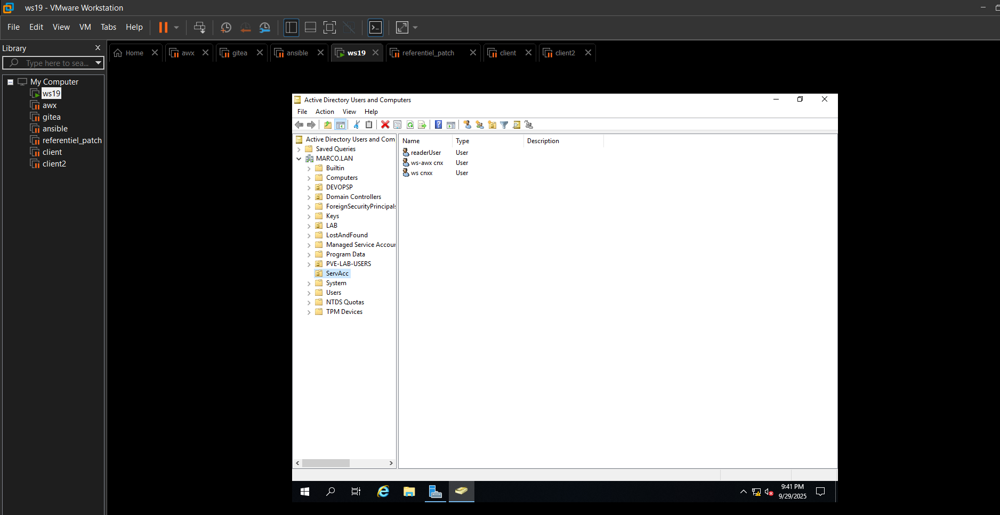

# PROJET : AUTHENTIFICATION ET INTEGRATION D'UN UTILISATEUR DE L'ACTIVE DIRECTORY DANS AWX-OPERATOR VIA LDAP

---

## SOMMAIRE

1. [INTRODUCTION](#introduction)
2. [PREREQUIS](#prerequis)
3. [Formation sur l'administration windows serveur 2019](#formation-windows-server-2019)
4. [IMAGE DE DIFFERENTS USERS DANS UNE UNITE D'ORGANISATION](#image-de-differents-users-dans-une-unite-dorganisation)

---

## INTRODUCTION 

Dans un environnement informatique croissant, la sécurité est devenue un élément clé qui permet de gérer les différentes ressources telles que :

- les utilisateurs
- les objets
- les groupes
- etc

Sur ce, afin de mieux les gérer, on adopte une certaine politique de sécurité permettant d'attribuer les droits aux différentes ressources existantes au sein d'une structure informatique. Dans le cadre de notre projet nous allons mettre en place une politique de sécurité qui permettra à un utilisateur de s'authentifier de manière sécurisée et contrôlée.

---

## PREREQUIS

- OS : Windows server 2019
- Disque : SSD 60GO
- RAM : 2GO
- HYPERVISEUR DE TYPE 1 ou 2

---

## FORMATION WINDOWS SERVER 2019

Voici un lien sur une formation dédiée de Windows server 2019:

- [Formation sur l'administration windows serveur 2019 avec Armel Ngando de Teachmemore](https://teachmemore.fr/courses/windows-server-2019-administration)

---

## IMAGE DE DIFFERENTS USERS DANS UNE UNITE D'ORGANISATION

