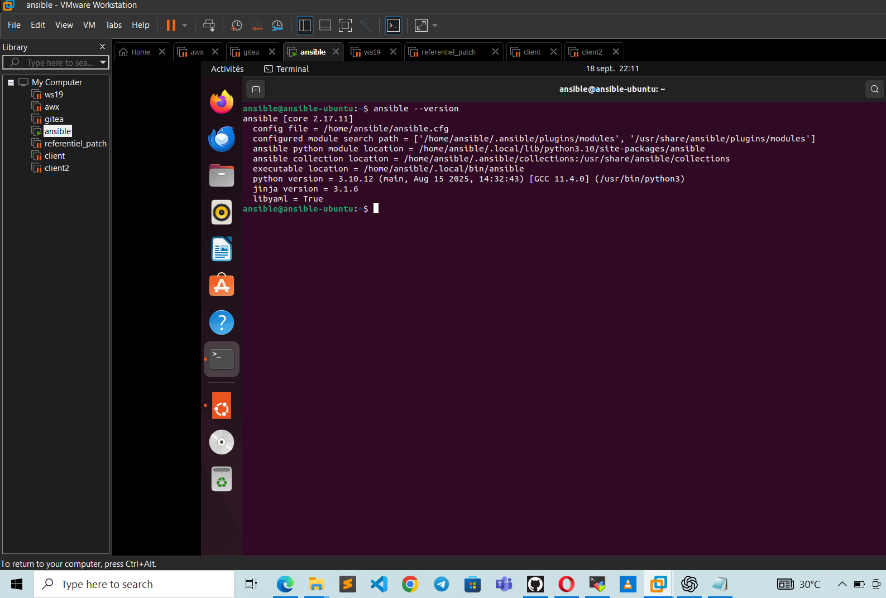

# 🚀 Projet : CONFIGURATION AVEC ANSIBLE

---

## SOMMAIRE
- [🚀 Projet : CONFIGURATION AVEC ANSIBLE](#-projet--configuration-avec-ansible)
  - [SOMMAIRE](#sommaire)
  - [📝 INTRODUCTION](#-introduction)
  - [🐙 LIEN SUR LE FICHIER DE CONFIGURATION ANSIBLE POUR LES DEUX MACHINES CLIENTES](#-lien-sur-le-fichier-de-configuration-ansible-pour-les-deux-machines-clientes)
  - [🔧 PREREQUIS](#-prerequis)
  - [🛠️ INSTALLATION ANSIBLE](#️-installation-ansible)
  - [🆔 VERSION ANSIBLE INSTALLEE](#-version-ansible-installee)
  - [🧰 OUTILS UTILISES](#-outils-utilises)
  - [🧰 QUELQUES COMANDES](#-quelques-comandes)

---

## 📝 INTRODUCTION

Actuellement, nous voyons bel et bien comment les connaissances sur l'automatisation ne cessent de se développer dans le monde informatique. Car elles permettent de réduire les différentes erreurs humaines afin de pouvoir pousser sans problème les configurations sur plusieurs équipements à la fois et cela engendre un gain de temps maximal tout en permettant de suivre correctement les différents équipements. Dans le cadre de notre projet nous allons utilisé ansible afin de configurer nos deux machines clientes et ensuite permettre une planification progressive dans AWX en fonction du besoin.

---

## 🐙 LIEN SUR LE FICHIER DE CONFIGURATION ANSIBLE POUR LES DEUX MACHINES CLIENTES

- [Lien GitHub pour la configuration du projet avec ansible](https://github.com/jeanmarctsh/ansible_project)
- Branche principale : patchlab

Pourquoi ai-je utilisé ansible?
Compte tenu des spécificités de mon ordinateur, j'ai utilisé une VM ansible afin de mieux gérer les ressources de mon ordinateur: 
c'est-à-dire RAM et CPU. Afin de configurer les machines clientes et transférer le dossier compresser au niveau du serveur Gitea avec le protocol rsync

---

## 🔧 PREREQUIS

- OS : Ubuntu 22.04 LTS
- Disque : SSD 25GO
- RAM : 6GO
- HYPERVISEUR DE TYPE 1 ou 2

---

## 🛠️ INSTALLATION ANSIBLE

Afin d'installer ansible, cliquer sur le lien ci-après:

- [Installation ansible site officielle](https://docs.ansible.com/ansible/latest)
- [Guide pas à pas avec Teachmemore](https://teachmemore.fr/courses/ansible-pour-les-administrateurs-systemes-linux)

---

## 🆔 VERSION ANSIBLE INSTALLEE

Voici la version d'ansible installé sur notre la VM Linux dédiée

---

## 🧰 OUTILS UTILISES

- Vscode. 
- Protocol rsync.
- OS: Linux (pour exécuter les différentes commandes administratives et la gestion des utilisateurs ainsi que de différentes permissions).
- SSH
- Hyperviseur type2: VMware-workstation-full-17.5.0-22583795.
- Deux machines clientes ci-dessous : *abstract: 192.168.9.132* *marco1: 192.168.9.133*

---

## 🧰 QUELQUES COMANDES

- Pour effectuer une commande test sans changement du fichier d'inventaire : ansible -i devops/inventory/hosts.yml devops/playbook/apt --check
- Pour exécuter un playbook : ansible-playbook -i devops/inventory/hosts.yml devops/playbook/apt.yml -K
- Pour Vérifier la synthaxe du fichier apt.yml : ansible-playbook -i devops/inventory/hosts.yml devops/playbook/apt.yml --syntax-check
- Pour tester la connectivité : ansible -i devops/inventory/hosts.yml all -m ping

