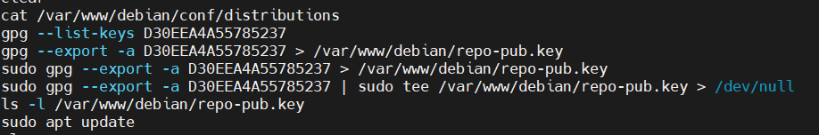

# PROJET : CONFIGURATION ET  INTEGRATION DES MACHINES CLIENTES DU SYSTEME DANS AWX-OPERATOR

---

## SOMMAIRE

1. [INTRODUCTION](#intoduction)
2. [OUTILS UTILISES](#outils-utilises)
3. [PREREQUIS](#prerequis)
4. [CLIENTS](#clients)
5. [FONCTIONNEMENT](#fonctionnement)
6. [CLIENTS JOIGNANT LE REFERENTIEL LOCAL](#clients-joignant-le-referentiel-local)


---

## INTODUCTION

Dans un monde informatique hyperconnecté, effectuer une mise à jour constitue un élément majeur qui garantit le bon fonctionnement de différents équipements au sein d'un système informatique. Et cela doit se faire de manière contrôlée pour éviter la compromission et le fonctionnement du système existant.  

---

## OUTILS UTILISES

1. SSH
2. OS: Linux pour la configuration répertoire : /etc/apt/sources.list.d/nom_du_fichier.list et la création d'un utulisateur de service dédié


---

## PREREQUIS

- OS : Ubuntu 22.04 LTS
- Disque : SSD 20GO
- RAM : 2GO
- HYPERVISEUR DE TYPE 1 ou 2

---

## CLIENTS

voici les différentes machines clientes de notre infrastructure : 

  ### CLIENT1
  - USERNAME: Abstract
  - IP: 192.168.9.132
  - Utilisateur de service: ansi


  ### CLIENT2

  - USERNAME: marco1
  - IP: 192.168.9.133
  - Utilisateur de service: ansi

## FONCTIONNEMENT

Voici un schéma explicatif décrivant le fonctionnement d'une machine cliente lors :

1. D'une mise à jour depuis internet.
2. D'une mise à jour depuis un référentiel local.


Lorsqu'une machine cliente fait une mise à jour depuis Internet, elle se connecte et va vers les différentes sources renseignées au niveau du fichier de configuration (__/etc/apt/sources.list__) afin de récuperer les paquets. Cela pourrait engendrer une faille du point de vue sécurité.


Mais lorsqu'on décrit les différentes règles au niveau d'un fichier (__etc/apt/sources.list.d/nom_du_fichier.list__) afin qu'une machine fasse directement une depuis un serveur de référentiel local géré et contrôlé cela engendre un premier niveau de sécurité car tout est contrôlé il n'existe aucune dépendance externe. Tout se passe en local. 

---

## CLIENTS JOIGNANT LE REFERENTIEL LOCAL

Afin de permettre aux machines clientes de joindre le référentiel local, il faut procéder de la manière ci-après:

  ### EXPORTATION DE LA CLE PUBLIQUE 

  l'exportation de la clé publique se fait de la manière suivante :

  - 

  on voit bel bien comment on exporte la clé publique du serveur (référentiel local) avec la commande ci-après:

  ```shell 
  $ sudo gpg --export -a [la clé publique (gpg --list-keys)] | sudo tee /var/www/nom_du_dossier_crée/nom_de_la_clé.gpg
  ```
    
  
  ---

  ### SCRIPT POUR CONFIGURER LES MACHINES CLIENTES

  Voici les deux scripts à exécuter pour permettre aux machines clientes de joindre le référentiel local:  

  ```shell 
  $ curl -fsSL http://192.168.9.120/debian/repo-pub.key | gpg --dearmor | sudo tee /etc/apt/keyrings/nom_de_la_clé_gpg.gpg > /dev/null 
  ```

  ```shell 
  $ sudo nano /etc/apt/sources.list.d/nom_fichier.list/
  ```
  ensuite coller : deb [arch=amd64 signed-by=/etc/apt/keyrings/nom_de_la_clé_gpg.gpg] http://192.168.9.120/debian jammy main

  NB : 192.168.9.120 est l'adresse IP du Serveur(référentiel local). mettre l'adresse en fonction de sa configuration réseau


