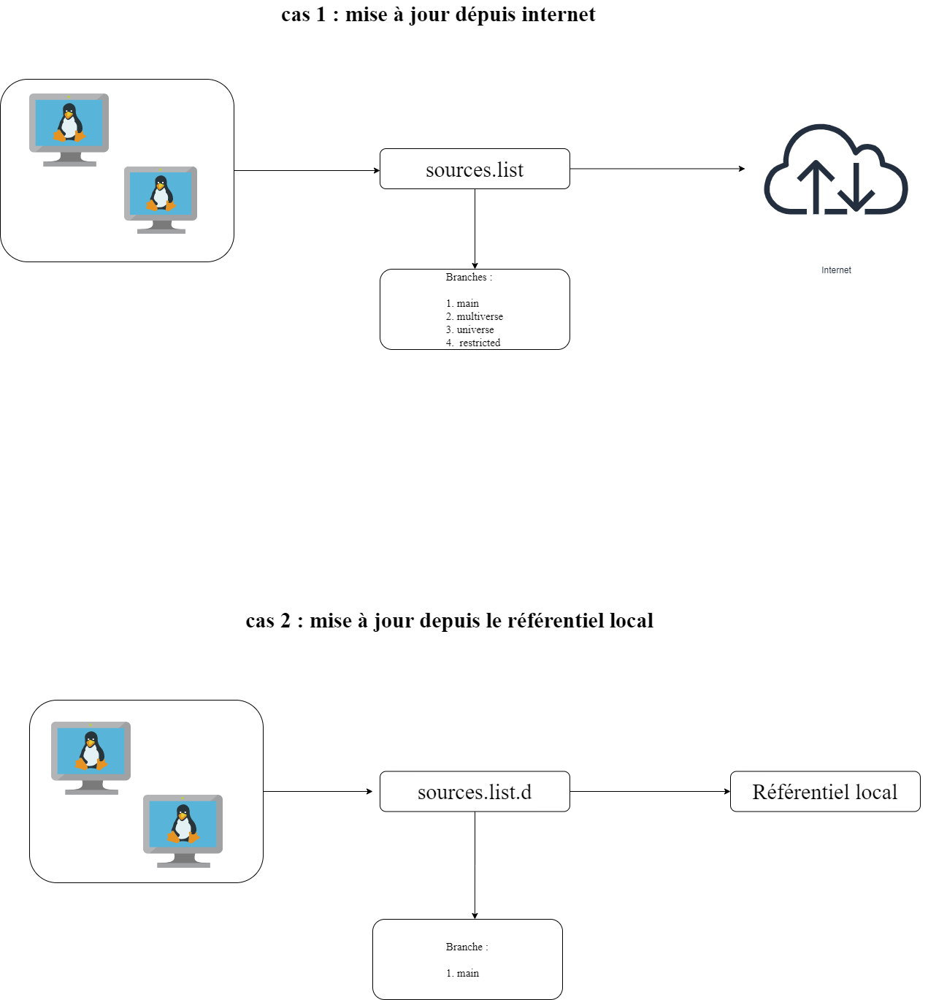

# PROJET : CONFIGURATION ET  INTEGRATION DES MACHINES CLIENTES DU SYSTEME DANS AWX-OPERATOR

---

## SOMMAIRE

1. [INTRODUCTION](#intoduction)
2. [OUTILS UTILISES](#outils-utilises)
3. [PREREQUIS](#prerequis)
4. [CLIENTS](#clients)
5. [FONCTIONNEMENT](#fonctionnement)

---

## INTODUCTION

Dans un monde informatique hyperconnecté, effectuer une mise à jour constitue un élément majeur qui garantit le bon fonctionnement de différents équipements au sein d'une structure informatique. Et cela doit se faire de manière contrôlée pour éviter de compromettre le fonctionnement du système existant.  

---

## OUTILS UTILISES

1. SSH
2. OS: Linux pour la configuration répertoire : /etc/apt/sources.list.d/nom_du_fichier.list et la création d'un utulisateur de service dédié

---

## PREREQUIS

- OS : Ubuntu 22.04 LTS
- Disque : SSD 20GO
- RAM : 2GO
- HYPERVISEUR DE TYPE 1 ou 2

---

## CLIENTS

voici les différentes machines clientes de notre infrastructure : 

  ### CLIENTS1
  - USERNAME: Abstract
  - IP: 192.168.9.132
  - Utilisateur de service: ansi

  ### CLIENT2

  - USERNAME: marco1
  - IP: 192.168.9.133
  - Utilisateur de service: ansi

## FONCTIONNEMENT

Voici un schéma explicatif décrivant le fonctionnement d'une machine cliente lors :

1. D'une mise à jour depuis internet.
2. D'une mise à jour depuis un référentiel local.

Lorsqu'une machine cliente fait une mise à jour depuis Internet, elle se connecte et va vers les différentes sources renseignées au niveau du fichier de configuration (__/etc/apt/sources.list__) afin de récuperer les paquets. Cela pourrait engendrer une faille du point de vue sécurité.

Mais lorsqu'on décrit les différentes règles au niveau d'un fichier (__etc/apt/sources.list.d/nom_du_fichier.list__) afin qu'une machine fasse directement une depuis un serveur de référentiel local géré et contrôlé cela engendre un premier niveau de sécurité car tout est contrôlé il n'existe aucune dépendance externe. Tout se passe en local. 

