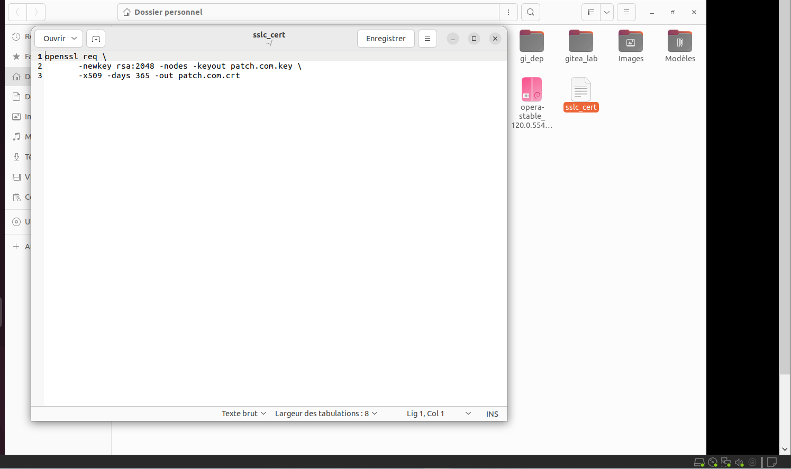
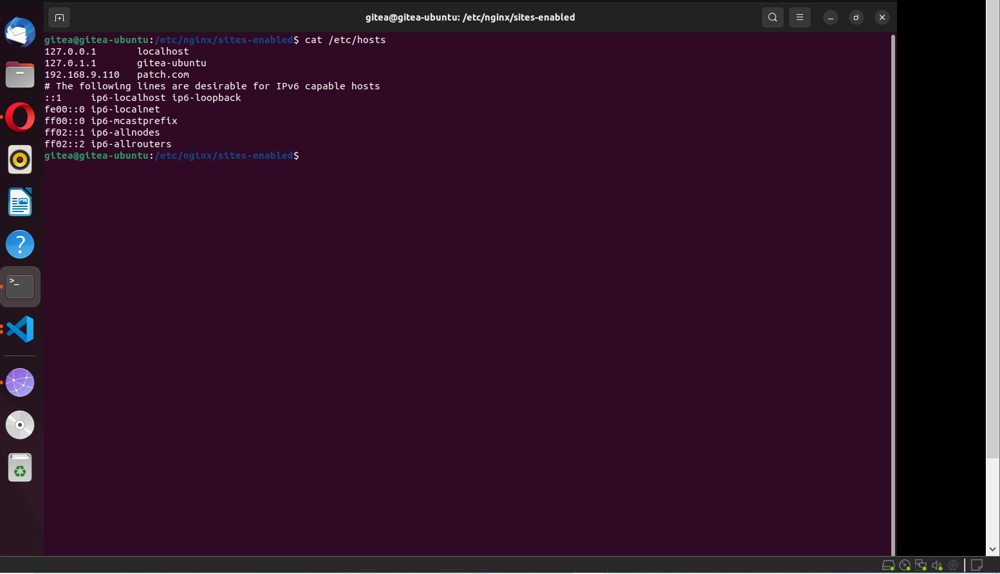

# 🚀 INSTALLATION ET UTILISATION DE NGINX EN TANT QUE REVERSE PROXY

Dans le cadre de cette première partie, nous allons utiliser la combinaison: nginx + openssl. 
__NB: Adapter le contenu en fonction de vos besoins__
---

## SOMMAIRE

- [🚀 INSTALLATION ET UTILISATION DE NGINX EN TANT QUE REVERSE PROXY](#-installation-et-utilisation-de-nginx-en-tant-que-reverse-proxy)
  - [__NB: Adapter le contenu en fonction de vos besoins__](#nb-adapter-le-contenu-en-fonction-de-vos-besoins)
  - [SOMMAIRE](#sommaire)
  - [📝 INTRODUCTION](#-introduction)
  - [🛠️ INSTALLATION DE NGINX](#️-installation-de-nginx)
  - [🛠️ INSTALLATION DE OPENSSL](#️-installation-de-openssl)
  - [🛠️ CONFIGURATION OPENSSL POUR GENERER LES CERTIFICATS, DNS, ETC](#️-configuration-openssl-pour-generer-les-certificats-dns-etc)
  - [🛠️ DECLARATION DE NOTRE DOMAIN CREE DANS etc/hosts POUR LA RESOLUTION DE NOM](#️-declaration-de-notre-domain-cree-dans-etchosts-pour-la-resolution-de-nom)
  - [🛠️ CONFIGURATION DE NGINX EN TANT QUE REVERSE PROXY](#️-configuration-de-nginx-en-tant-que-reverse-proxy)
  - [🛠️ VERIFICATION FINALE ET REDEMARRAGE DU SERVICE](#️-verification-finale-et-redemarrage-du-service)

---

## 📝 INTRODUCTION

De nos jours, il est important de reconnaître qu’en entreprise une application, un logiciel mal configuré constitue un risque majeur de sécurité et cela expose l’infrastructure en interne. Pour Pallier ce problème, il est important d’installer et d’utiliser les bons outils. Dans le cadre de ce projet nous allons utiliser deux approches. Une approche manuelle avec nginx et une approche dynamique avec treafik. Ces différentes approches permettront de mettre en place certains mécanismes de sécurité de base afin de garantir le bon fonctionnement de l’infrastructure  interne (application, logiciel, serveur, etc…) tout en évitant d’exposer l’adresse IP réelle utilisée. 

---

## 🛠️ INSTALLATION DE NGINX

Pour utliser les différents services de nginx il faut l'installer. l'installation se fera avec le gestionnaire de paquets APT

```shell 
$ sudo apt install nginx -y
```

---

## 🛠️ INSTALLATION DE OPENSSL

Dans un système informatique, il y a généralement échange d'information entre différents terminaux, afin de garantir un niveau de sécurité en local, dans le cadre de notre projet nous allons utiliser openssl(vu que nous sommes en local) pour chiffrer les différentes connexion, générer un certificat auto signé, etc... 
il faut l'installer si et seulemeent si ce n'est pas encore le cas.

Vérification si openssl est déjà installé: 

```shell 
$ opensll version
```

si openssl est non installé faire ce qui suit sur LINUX (Ubuntu / Debian): 

```shell 
$ sudo apt update && sudo apt install -y openssl
```

---

## 🛠️ CONFIGURATION OPENSSL POUR GENERER LES CERTIFICATS, DNS, ETC

Afin de générer les clés, il faut procéder de la manière suivante: 




## 🛠️ DECLARATION DE NOTRE DOMAIN CREE DANS etc/hosts POUR LA RESOLUTION DE NOM

Pour mieux gérer le domain crée il faut le déclarer au niveau de : etc/hosts afin de l'utiliser plus tard 

```shell 
$ sudo cat /etc/hosts && nano /etc/hosts
```


---

## 🛠️ CONFIGURATION DE NGINX EN TANT QUE REVERSE PROXY

Pour utiliser nginx en tant que reverse proxy, il faut procéder de la manière suivante:

```shell 
$ sudo nano /etc/nginx/sites-available/nom_du_fichier
```
Voir la configuration ici: 

[Fichier de configuration gitea pour reverse proxy](gitea)

```shell 
$ sudo ln -s /etc/nginx/sites-available/nom_du_fichier /etc/nginx/sites-enabled/
```
---

## 🛠️ VERIFICATION FINALE ET REDEMARRAGE DU SERVICE

Afin de vérifier que tout fonctionne correctement, il faut procéder de la manière suivante:

```shell 
$ sudo nginx -t
```

```shell 
$ sudo systemctl reload nginx.service
```

__NB: l'avantage de gitea est qu'on peut l'utiliser en mode hors ligne et faire des push comme on le fait sur github mais avec un mode connecté.__


