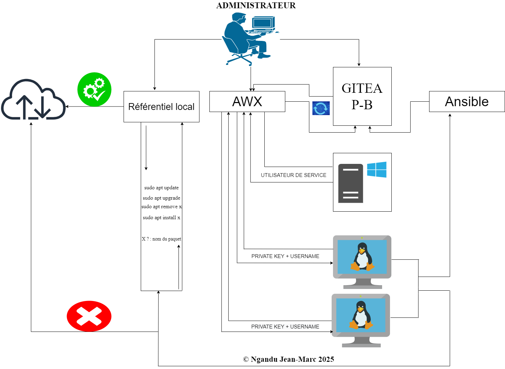

# 🚀 PROJET : AUTOMATISATION DU PATCH MANAGEMENT AVEC AWX ET ANSIBLE

__🔄 Etant dans un monde technologique en constante évolution, ce projet reste ouvert à l'ajout de nouvelles fonctionnalités, en fonction de l'évolution  des besoins__

---

## SOMMAIRE

- [🚀 PROJET : AUTOMATISATION DU PATCH MANAGEMENT AVEC AWX ET ANSIBLE](#-projet--automatisation-du-patch-management-avec-awx-et-ansible)
  - [SOMMAIRE](#sommaire)
  - [📝 INTRODUCTION](#-introduction)
  - [🌟 WORKFLOW DU PROJET](#-workflow-du-projet)
  - [🌐🖧 ARCHITECTURE PHYSIQUE DU PROJET](#-architecture-physique-du-projet)
  - [⚙️ MECANISME DE FONCTIONNEMENT DU PROJET](#️-mecanisme-de-fonctionnement-du-projet)
  - [🧰 OUTILS ET TECHNOLOGIES UTILISES](#-outils-et-technologies-utilises)
  - [✍️ AUTEUR](#️-auteur)

---

## 📝 INTRODUCTION

De nos jours, gérer un système informatique en toute sécurité n’a jamais été une tâche facile. Cela implique la mise en oeuvre de plusieurs mécanismes visant à limiter les risques de compromission du système existant. Il est donc essentiel et nécessaire de nos jours qu’une équipe IT maîtrise ces mécanismes afin non seulement d’assurer la sécurité des systèmes, mais aussi d’améliorer la productivité et de réduire la complexité liée aux déploiements massifs ou aux simples mises à niveau.

Le choix des outils dépend toujours des besoins rencontrés en entreprise. Dans le monde IT actuel, on observe une forte évolution dans des domaines tels que la sécurité, le cloud, la gestion des ressources (physiques ou virtuelles) ainsi que celui de l'automatisation. 
Automatiser est une bonne pratique, mais il est encore plus important de savoir précisément quoi automatiser afin de réduire les erreurs humaines.

Ce projet consiste à mettre en place une solution de gestion centralisée basée sur Ansible et AWX. Cette solution permettra d’avoir une vision globale de différents correctifs (paquets, images, etc.) et d’effectuer des mises à niveau de manière plus sécurisée, contrôlée et planifiée. Pour mener à bien ce projet, nous adopterons plusieurs notions clés telles que la sécurité (locale et utilisateur), l’automatisation, la synchronisation, le versioning et la planification.

---

## 🌟 WORKFLOW DU PROJET

Compte tenu de la charge du travail, il serait plus judicieux de travailler avec un ordinateur ayant suffisamment des ressources en RAM (suite à la charge du travail qui augmente progressivement) et un bon stockage. De préférence un disque de type SSD supérieur ou égal  1TO.

Voici le workflow général de notre projet:

---

## 🌐🖧 ARCHITECTURE PHYSIQUE DU PROJET

le projet comprend : 4 Serveurs Linux, 1 Serveur Windows et 2 machines clientes.

* Serveur Linux
  
  1. Linux : Pour le serveur AWX
  2. Linux : Pour le serveur Gitea
  3. Linux : Pour le référentiel local
  4. Linux : Pour Ansible

* Serveur Windows

  1. Serveur Windows 2019

* Machines clientes
  
  1. Linux : client_1 (abstract)
  2. Linux : client_2 (marco1)

---

## ⚙️ MECANISME DE FONCTIONNEMENT DU PROJET

- Pour le serveur AWX : il sera le gestionnaire central de notre projet, synchronisé avec Gitea afin de récupérer automatiquement les différents fichiers de configuration. Et la mise à niveau  pourra se faire de manière contrôlée.

- Pour le serveur Gitea : il sera utilisé pour le versioning de nos différents fichiers de configuration et sera intégré à AWX pour une bonne synchronisation.

- Pour le serveur Ansible : il sera utilisé comme zone neutre en fonction des caractéristiques de la machine hôte  et partagera le fichier complet au serveur Gitea.

- Pour le référentiel local : il permettra aux machines clientes d'effectuer une mise à niveau de manière sécurisée et contrôlée.

- Pour le serveur Windows 2019 : il permettra une authentification sécurisée afin d'intégrer l'utilisateur de service de l'Active Directory à AWX via le protocol LDAP.

- Pour les machines clientes : elles seront intégrées à AWX et via un utilisateur de service créé au niveau de ces dernières, les différentes configurations seront appliquées et les mises à jour ne se feront en local via le référentiel local déployé avec reprepro

---

## 🧰 OUTILS ET TECHNOLOGIES UTILISES

* Comme système d'exploitation nous avons utilisé :

  | ID | Système d'exploitation |
  |----|------------------------|
  | 1  | LINUX                  |
  | 2  | WINDOWS                |

* Comme outils pour mettre en place notre projet nous avons utilisé :

  | ID | OUTILS                                                                 | OBJECTIFS |
  |----|------------------------------------------------------------------------|-----------|
  | 1  | reprepro                                                               | Déploiement et mise en place d'un dépôt APT Local|
  | 2  | Serveur web (apache2 et nginx)                                          | Pour créer un lien symbolique du dépôt local, utiliser nginx comme reverse proxy, etc...    |
  | 3  | git et gitea                                                           | Pour le versionning et la gestion du code    |
  | 4  | Kubernetes                                                              | Déployer AWX-OPERATOR avec un cluster minikube |
  | 5  | Docker                                                                 | Déploiement et exécution de Gitea |
  | 6  | Openssl                                                                | Généreration des certificats de sécutité  |
  | 7  | Ansible                                                                | Configurer les machines clientes via différents Playbook |
  | 8  | Windows serveur                                                        | Pour une authentification sécurisée, gestion des droits nécessaires pour les utilisateurs |
  | 9 | Ssh                                                                    | Pour générer les clés SSH |
  | 10 | VS_code + MobaXterm                                                    | Accès à distance |
  | 11 | Rsync                                                                  | Pour le transfert de différents fichiers en local | 
  | 12 | LDAP                                                                   | Pour permettre la liaison entre un utilisateur (de service) de l'AD dans AWX |
  | 13 | Hyperviseur de type 2 (Vmware_workstation)                             | Construction et virtualisation de  l'architecture du projet |

    
---

## ✍️ AUTEUR
- Nom : Ngandu Jean-Marc
- 
- 
- 
